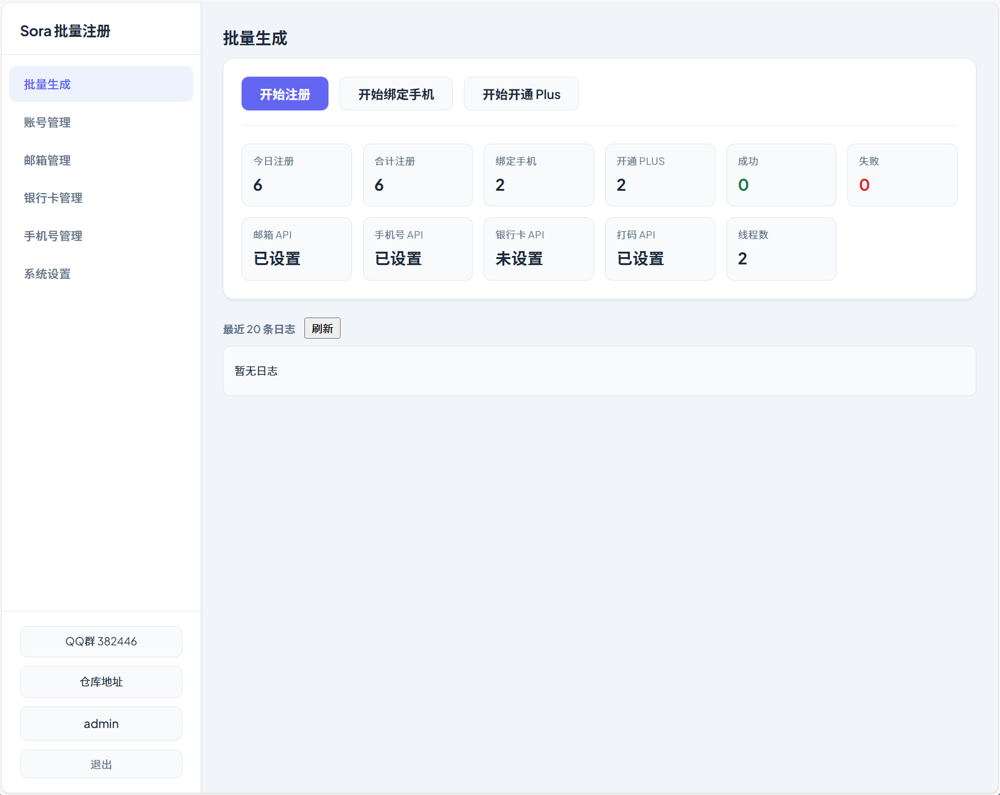
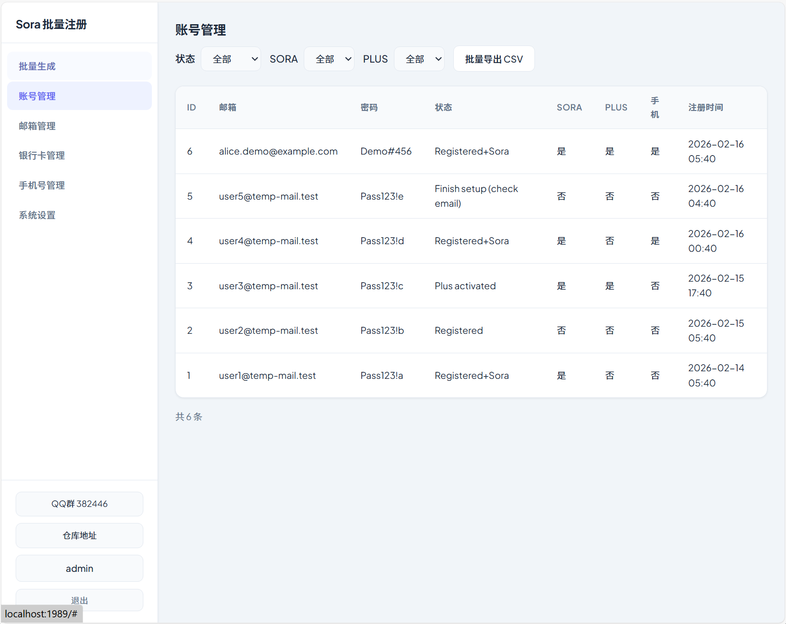
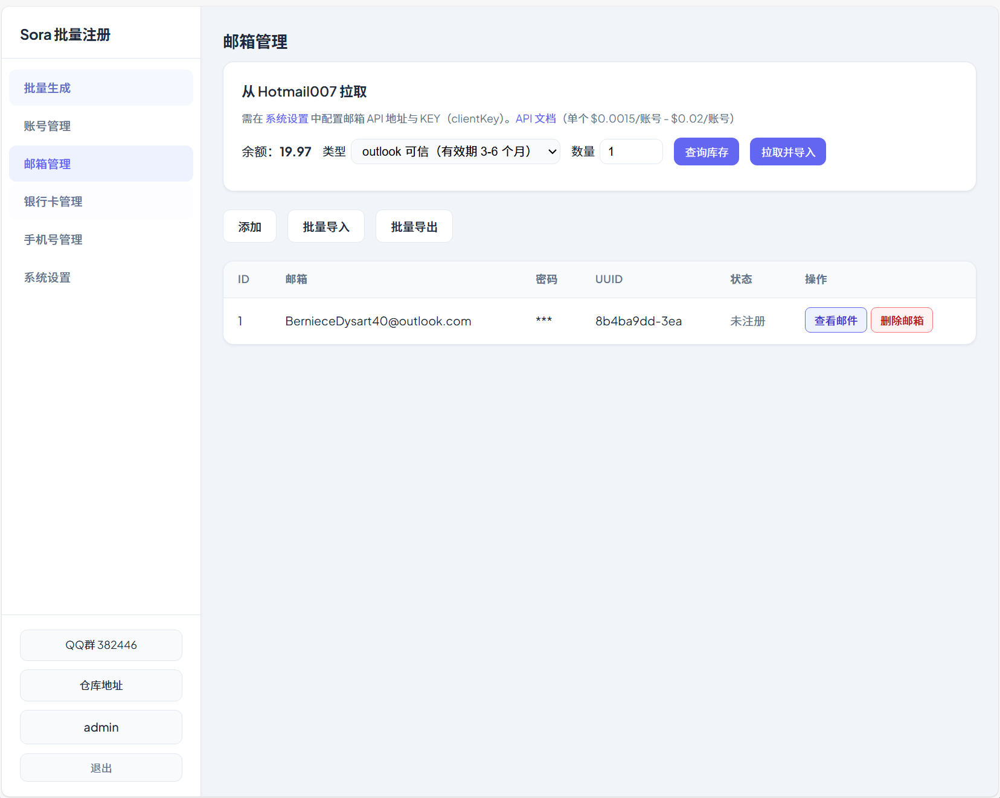
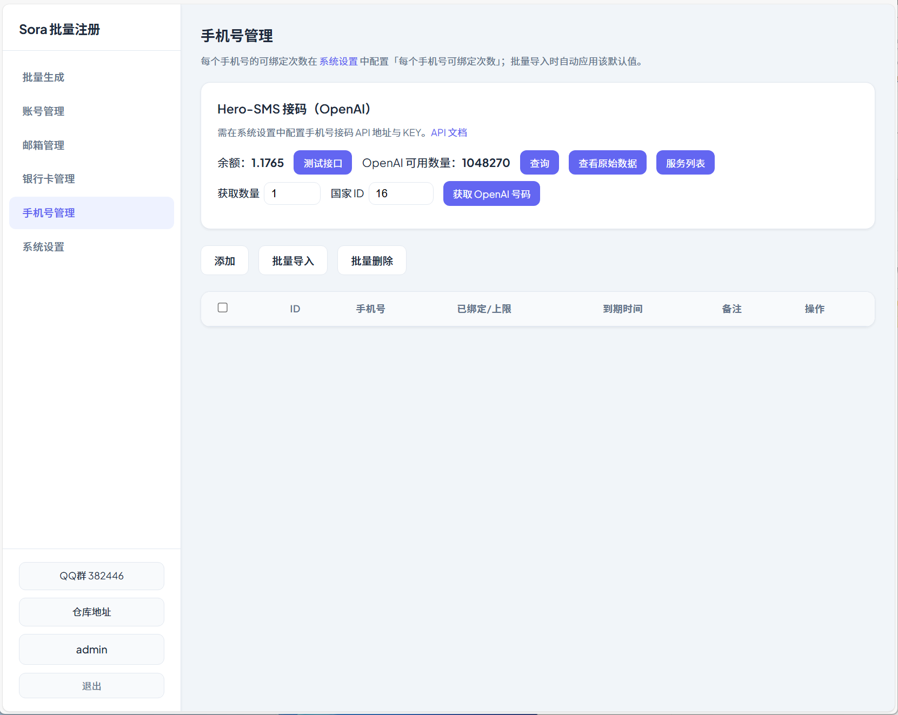
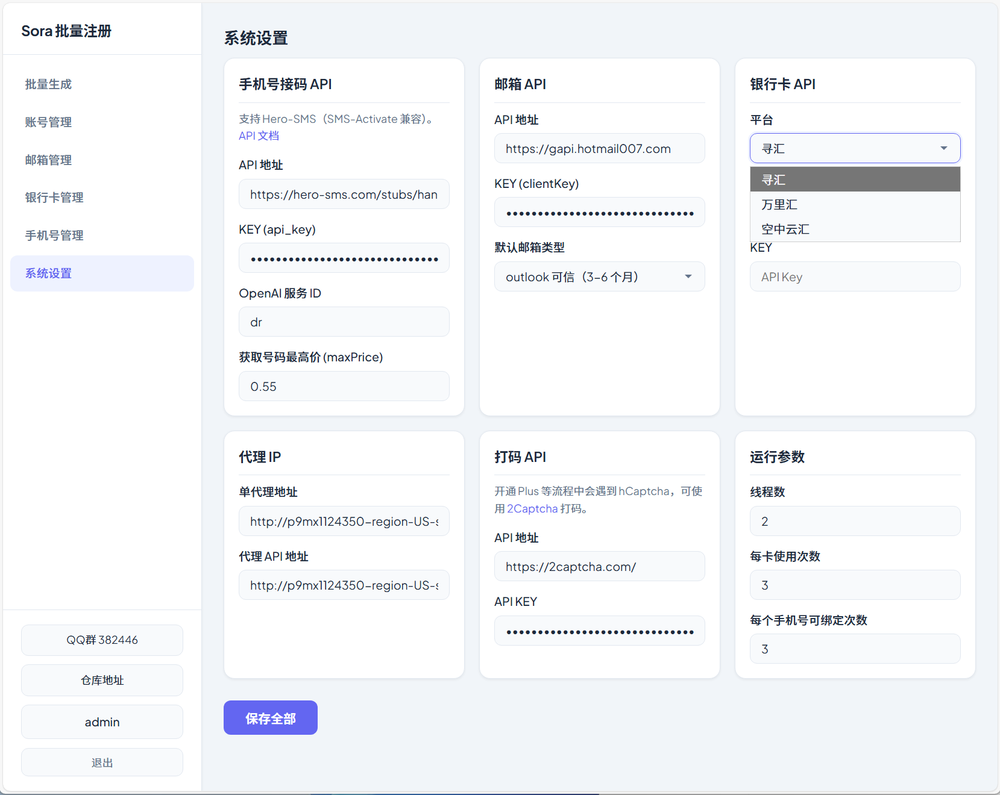

# Sora 批量注册管理端

独立开发的 ChatGPT / Sora 批量注册与管理后台，纯协议注册、无头运行，带 Web 控制台，支持邮箱/手机号/银行卡/打码 API 配置与账号全流程管理。

**技术交流 QQ 群：382446**

---

## 预览

|  |  |
|--------------------------------|--------------------------------|
|  |  |
|  | |

---

## 已实现功能

- **批量生成**：仪表盘统计（今日/合计注册、绑定手机、开通 Plus、成功失败数）、API 配置状态、线程数、最近运行日志
- **账号管理**：列表筛选（状态、Sora、Plus）、分页、批量导出 CSV
- **邮箱管理**：Hotmail007 拉取并导入（类型可选）、批量导入/导出、查看邮件（API 收信）、状态（已注册/未注册）、删除
- **银行卡管理**：列表、添加、批量导入/删除；系统设置支持平台选择（寻汇 / 万里汇 / 空中云汇）
- **手机号管理**：Hero-SMS 接码、获取号码、收码、销毁、删除、余额与 OpenAI 可用数
- **系统设置**：手机号接码 API、邮箱 API（含默认邮箱类型）、银行卡 API（含平台）、打码 API（2Captcha）、代理 IP、运行参数；点击侧栏用户名可修改登录账号与密码
- **注册与 Sora**：纯 HTTP 协议注册、Refresh Token 保存、Sora 激活；支持代理与 curl_cffi TLS 指纹

---

## 快速开始

```bash
# 安装依赖
pip install -r web/backend/requirements.txt

# 启动（默认端口 1989）
python web/run_web.py
```

浏览器访问 `http://localhost:1989`，使用系统内设置的账号密码登录。首次部署可参考 `spec/CONFIG_AND_DEPLOY.md` 或通过界面在「系统设置」中配置各 API。

---

## 开源与免责

本项目仅供**技术交流与学习**，请遵守相关服务条款与当地法律。

**技术交流 QQ 群：382446**
